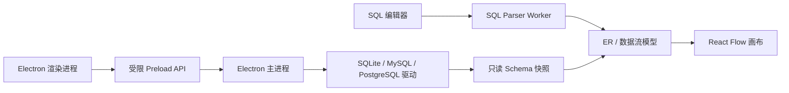

# SQL Visualizer

SQL Visualizer 是一个本地优先的 SQL 结构分析工具，可以把 SQL 转换为 ER 图和数据流图。它适合学习 SQL、阅读陌生查询、梳理表关系，以及结合本机数据库 Schema 检查字段和外键。

SQL 默认只在本机处理，不需要登录，也不会上传到服务器。

## Windows 下载

[下载安装版](https://github.com/duyanta123/SQL-/releases/latest/download/SQL-Visualizer-Setup.exe) · [下载便携版](https://github.com/duyanta123/SQL-/releases/latest/download/SQL-Visualizer-Portable.exe) · [查看历史版本](https://github.com/duyanta123/SQL-/releases)

- 安装版：支持选择安装目录，适合日常使用；工具栏可“检查更新”，新版本下载完成后退出应用时自动安装。
- 便携版：无需安装，下载后直接运行（便携版不支持自动更新，请手动下载新版）。
- Web 版：克隆源码后运行 `npm run dev`，但不能连接本机数据库。

Windows SmartScreen 可能会提示未知发布者。请确认文件来自本仓库的 GitHub Release 后，再选择“更多信息”并继续运行。

## 快速上手

1. 启动应用，将 SQL 粘贴到左侧编辑器。
2. 选择对应的 SQL 方言。
3. 在右侧切换“ER 图”或“数据流图”。
4. 使用“适应内容”或“布局”整理画布，也可以直接拖动节点。
5. 通过导出菜单保存 PNG 或 SVG（按当前主题导出）。
6. 工具栏右侧可切换亮色 / 暗色 / 跟随系统主题，偏好保存在本地。
7. 画布操作支持撤销 / 重做；顶部搜索框可按表名、列名或节点内容定位节点。

快捷键：`Ctrl+F` 聚焦画布搜索、`1` / `2` 切换 ER / 数据流图、`0` 适应内容、`Ctrl+Z` / `Ctrl+Shift+Z` 撤销 / 重做画布操作、编辑器内 `Ctrl+Shift+F` 格式化 SQL。

在手机浏览器中，使用顶部的“编辑器 / 图形”切换面板；次要操作位于图形页右上角的操作菜单中。

## 可以分析什么

- `SELECT`、`JOIN`、`UNION`、CTE（含递归 CTE）、子查询。
- `CREATE TABLE`、`CREATE TABLE AS SELECT`、`CREATE VIEW`。
- `INSERT ... SELECT`、`UPDATE`、`DELETE`，以及 `INSERT ... ON DUPLICATE KEY UPDATE` / `ON CONFLICT DO UPDATE`（标记为 UPSERT）。
- 投影、JOIN、`WHERE` 和 `HAVING` 中带表名或别名的字段引用。
- 列级血缘：数据流图中悬停表与结果之间的连线，可查看每个结果列来自哪张表的哪个字段（含聚合、`CASE`、窗口函数、类型转换等表达式的原始文本），以及 `WHERE`/`HAVING` 中引用该表的过滤列。
- 表达式展示：JOIN 条件悬浮层保留完整的 `AND`/`OR` 与括号分组；结果节点显示 `WHERE`/`HAVING` 摘要。
- DDL 中的主键、唯一键和外键关系。

解析器暂不支持的语句（如 T-SQL `MERGE`、PostgreSQL `CREATE MATERIALIZED VIEW`）会保留上一次有效图形并显示错误提示。

普通查询中推断出的字段会显示“推断”标记。类型通过启发式推测：数值比较、聚合参数、数值运算与 CAST 推断为 `number`，`LIKE` 与字符串字面量推断为 `string`，布尔字面量推断为 `boolean`，日期字面量推断为 `date`；证据冲突时保持 `unknown`（不猜测），且绝不覆盖 DDL 或真实 Schema 的类型。未限定表名且无法可靠归属的字段不会被强行放入某张表。

字段信息按以下优先级合并：

1. 当前 SQL 中的 DDL 定义。
2. 已连接数据库的真实 Schema。
3. 从 SQL 查询中推断的字段。

支持的解析方言包括 MySQL、MariaDB、PostgreSQL、SQLite、SQL Server、BigQuery、Athena、DB2、Hive、Redshift、Flink SQL、Trino 和 Snowflake。解析器支持不代表覆盖了数据库的所有私有扩展语法。

## 连接本机数据库

数据库连接只在 Windows 桌面版提供。当前支持：

| 数据库 | 连接方式 | 读取内容 |
| --- | --- | --- |
| SQLite | 选择本机数据库文件 | 表、视图、列、主键、唯一键、外键、索引 |
| MySQL | 主机、端口、数据库、用户名、密码 | `information_schema` 中的 Schema 元数据（含注释、索引、视图） |
| PostgreSQL | 主机、端口、数据库、用户名、密码、Schema | `information_schema` 中的 Schema 元数据（含注释、索引、视图、CHECK 约束） |
| SQL Server | 主机、端口、数据库、SQL 或 Windows 集成认证、Schema（默认 dbo） | `INFORMATION_SCHEMA` 中的 Schema 元数据 |

读取的注释会显示在 ER 图节点与列的悬停提示中；Schema 面板中视图带“视图”标记，可与其他表一样勾选展示。

连接步骤：

1. 点击图形工具栏中的“数据库”。
2. 选择数据库类型并填写连接信息。
3. 先测试连接，再点击“连接并读取 Schema”。
4. 在 Schema 面板中搜索或勾选需要显示的表。
5. 在 ER 图范围中切换“SQL”与“Schema”。

“当前 SQL”只显示查询涉及的表，并用真实 Schema 补全字段；“数据库 Schema”显示当前勾选的数据库表。数据流图始终只基于当前 SQL。

### Schema 同步

- 自动同步默认关闭。
- 开启后会立即同步一次，之后每 30 秒同步。
- “立即刷新”可以随时手动同步。
- 同步失败时保留上一次有效快照，并显示过期状态和错误信息。
- 新表默认加入选择；手动取消的表保持取消；已删除的表会从选择和图形中移除。

## 工作区和文件

- 工作区保存在浏览器或桌面应用的本地 IndexedDB 中。
- 每个工作区支持多个 SQL 标签页：编辑器顶部的标签栏可新建、切换、关闭（双击重命名）；每个标签页独立保存 SQL、方言、视图、节点位置和表选择。
- `.sql` 文件只包含当前标签页的 SQL 文本。
- `.sqlviz` 文件可保存全部标签页、方言、视图、节点位置、表选择和无密码的 Schema 快照。
- 分享链接只包含当前标签页的 SQL 和基础视图信息，不包含数据库凭据或完整 Schema。
- 旧版 `schemaVersion: 1` / `2` 工作区会自动迁移到当前格式（`3`）。

## 数据和隐私

| 数据 | 如何处理 |
| --- | --- |
| SQL 文本 | 在本机解析，不上传服务器 |
| 数据库内容 | 不读取业务数据，只读取 Schema 元数据 |
| 任意 SQL | 不提供执行入口，渲染进程也没有任意 SQL IPC |
| 数据库密码 | 默认不保存 |
| 已记住的密码 | 使用 Electron `safeStorage` 调用系统能力加密保存 |
| `.sqlviz` 和分享链接 | 不写入明文密码 |

桌面版的渲染进程不直接访问 Node.js 或数据库驱动。所有数据库操作都经过严格的 preload API 和主进程白名单。

## 常见问题

### 图形中没有字段

确认字段使用了表名或别名，例如 `users.id` 或 `u.id`。无法确认归属的 `id` 不会被自动分配。连接数据库后，可以用真实 Schema 补全字段。

### SQLite 无法打开

确认文件存在、当前 Windows 用户具有读取权限，并且文件不是依赖专用扩展的加密数据库。

### MySQL 或 PostgreSQL 连接失败

- `ECONNREFUSED`：数据库服务未启动、端口错误或服务未监听当前地址。
- `ETIMEDOUT`：检查防火墙、VPN、容器端口映射和监听地址。
- `Access denied` / `password authentication failed`：检查用户名、密码和数据库权限。
- PostgreSQL 默认 Schema 通常为 `public`，同时检查 `pg_hba.conf`。
- MySQL 账号需要能够读取相关 `information_schema` 元数据。

### SQL 输入错误后图形没有立即消失

这是预期行为。应用会保留上一次有效图形，并显示 SQL 错误提示，避免编辑过程中的短暂错误清空画布。

## 开发者指南

### 技术栈

- React 19、TypeScript、Vite。
- CodeMirror SQL 编辑器。
- React Flow 图形画布和 Dagre 自动布局。
- Web Worker + `node-sql-parser` 方言解析器。
- Zustand 状态管理和 IndexedDB 工作区存储。
- Electron 主进程与 context-isolated preload。
- `better-sqlite3`、`mysql2`、`pg` 数据库驱动。
- Vitest 和 Playwright 测试。

### 运行环境

- Node.js 22 或更高版本。
- npm 10 或更高版本。
- Web E2E 默认使用本机 Chrome。
- Windows 桌面打包需要 Windows x64 环境。

### 本地开发

```bash
git clone https://github.com/duyanta123/SQL-.git
cd SQL-
npm install
npm run dev
```

Vite 会在终端输出本地访问地址。Web 版保留 SQL 分析和工作区能力，但不会暴露 Electron 数据库 API。

启动桌面版：

```bash
npm run desktop:dev
```

该命令会先构建 Web 资源，再启动 Electron。

### 项目结构

```text
electron/             Electron 主进程、preload、连接配置和数据库 introspection
src/components/       编辑器、工具栏、画布、节点、对话框和 Schema 面板
src/parser/           AST 标准化、ER 图和数据流图构建
src/services/         数据库桥接、工作区存储和文件交换
src/store/            Zustand 应用状态
src/workers/          按方言加载解析器的 Web Worker
tests/                单元、集成、E2E 和桌面冒烟测试
```



数据库驱动由 Electron 主进程动态加载，不会进入 Web 主包。桌面版只注册以下 IPC：

- `database.testConnection`
- `database.introspectSchema`
- `database.disconnect`
- `database.listProfiles`
- `database.saveProfile`

### 常用命令

| 命令 | 用途 |
| --- | --- |
| `npm run dev` | 启动 Web 开发服务器 |
| `npm run desktop:dev` | 构建并启动 Electron 桌面版 |
| `npm test` | 运行 Vitest 单元和集成测试 |
| `npm run lint` | 运行 Oxlint |
| `npm run build` | 类型检查并生成 Web 生产包 |
| `npm run test:e2e` | 运行桌面、390×844、320×740 E2E |
| `npm run desktop:pack` | 生成 Windows 安装版和便携版 |

桌面产物位于 `release/`。`desktop:pack` 会为 Electron 重编译 `better-sqlite3`，完成后再恢复当前 Node.js 使用的原生模块 ABI，避免打包影响后续测试。

### 测试范围

- Parser：SELECT 字段推断、DDL/Schema/推断优先级、未限定字段处理。
- SQLite：真实临时数据库的列、主键、唯一键、外键和 Schema 变化。
- MySQL/PostgreSQL：mock 连接、参数化元数据查询和错误边界。
- 工作区：v1 到 v2 迁移、Schema 快照恢复、密码剔除。
- Electron：IPC 白名单、输入校验、preload 隔离和安装后启动。
- E2E：移动端布局、数据库范围、表选择、同步、工作区对话框、错误 SQL 和图形导出。

提交前建议执行：

```bash
npm test
npm run lint
npm run build
npm run test:e2e
```

## 项目边界

当前版本定位为个人学习和本地分析工具，不包含团队协作、在线数据库代理、云端凭据保存、服务端工作区同步或任意 SQL 执行能力。
